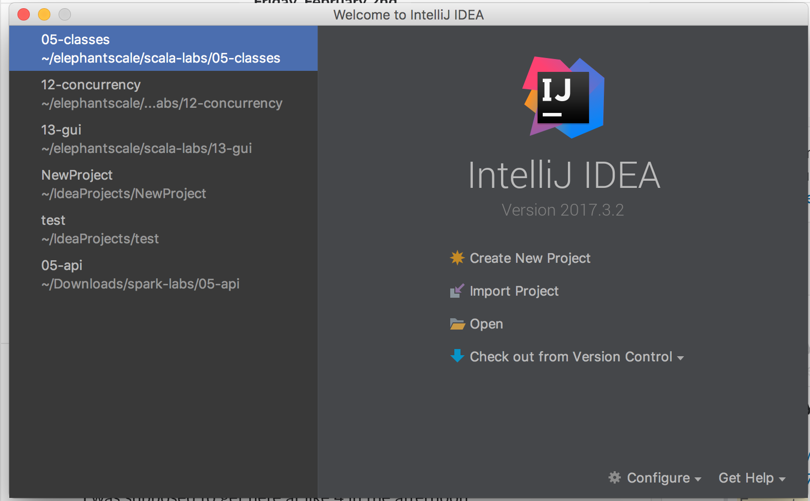

<link rel='stylesheet' href='../assets/css/main.css'/>

[<< back to main index](../README.md)

# Lab : Up and Running With Scala

### Overview
We will be running Scala in a single node mode.

### Depends On
None

### Run time
20 mins

## STEP 0: To Instructor
Please go through this lab on 'screen' first.

## STEP 1: Installing Scala and SBT for your platform

Install Scala for your platform.
http://www.scala-lang.org/

Also Install SBT for your platform


## STEP 2: Install Intellij

Download Intellij

Install the Scala plugin from jetbrains.


## STEP 3: Start IntelliJ 

You should see something like this:




## STEP 4:  Import this Project as an SBT Project.

Click on Import Project, and navigate to this directory. Click on the build.sbt file.

**=> Wait for it to import.  **

**=> Try to build the application**

## Step 5: Try to Run the application.

Try to run. See what happens.


## STEP 6: Download Scala labs
```bash
    $   cd
    $   git clone --depth 1  git@github.com:elephantscale/scala-labs.git

This will create a `scala-labs` directory that has all the labs.

Download the dataset
```bash
    # if  ~/data dir is missing, do the following
    # $   git clone --depth 1  git@github.com:elephantscale/datasets.git

    $   cd ~/data
    $   git pull
```
**Downloading the dataset to your own machine**  
Please see [README.md data section](../README.md#data)

