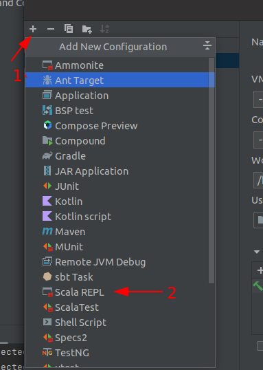
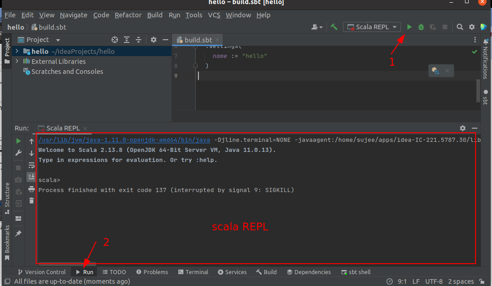

<link rel='stylesheet' href='../assets/css/main.css'/>

# Lab 2.1 : Scala REPL

## Overview

Play with Scala REPL environment

## Depends On

None

## Run time

10 mins

## For Instructor

**Please go through this lab on 'screen' first.**

## Notes

The REPL environment can be run either
1. Command line
2. Within a IDE

We will try both.

## Step 1 : Start a terminal  Window

Initialize SDKMan

```bash
$   source "$HOME/.sdkman/bin/sdkman-init.sh"
```

## Step 2 : Start Scala REPL

```bash
$  scala
```

You will see Scala shell as follows.

```console
Welcome to Scala 2.13.8 (Java HotSpot(TM) 64-Bit Server VM, Java 1.8.0_161).
Type in expressions for evaluation. Or try :help.

scala>
```

## Step 3 : Try the following REPL commands

```scala

scala>
    1 + 1

    println("hello world")

    :help

```

## Step 4 : Tab completion

Experiment with TAB completion.

Hint : Hit the TAB key after the dot (.)

Hint : Also try double-TAB

```scala
scala>
    "hello world".[TAB key]

    "hello world".toU[TAB key]

    "hello world".toUpperCase
    res3: String = HELLO WORLD
```

## Step 5 : Experiment with REPL

Try a few commands

```scala

scala>
    for (i <- 1 to 10)
        println(i)
```

## REPL in UI

We will show how to run REPL environment in Intellij IDE.

## Step 6 : Start IntelliJ IDE

### Instructor

Please make sure all students have IntelliJ up and running

## Step 7 : Create a Project

Make the following choices:

* File --> New Project
* Choose Scala project and select SBT
* Project definitions
    - Name your project 'hello'
    - Set the project directory
    - accept SBT and Scala versions

## Step 8: Creata a Scala REPL Runtime

- Click on 'Run --> Edit Configurations'
- Create a new Scala REPL runtime



## Step 9: Run the REPL env



## Step 10: Try the Same REPL Exercises